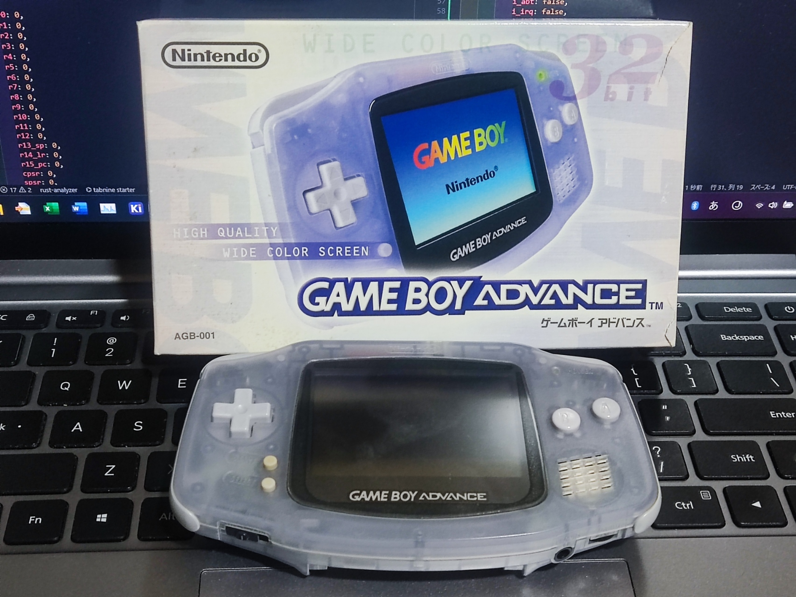
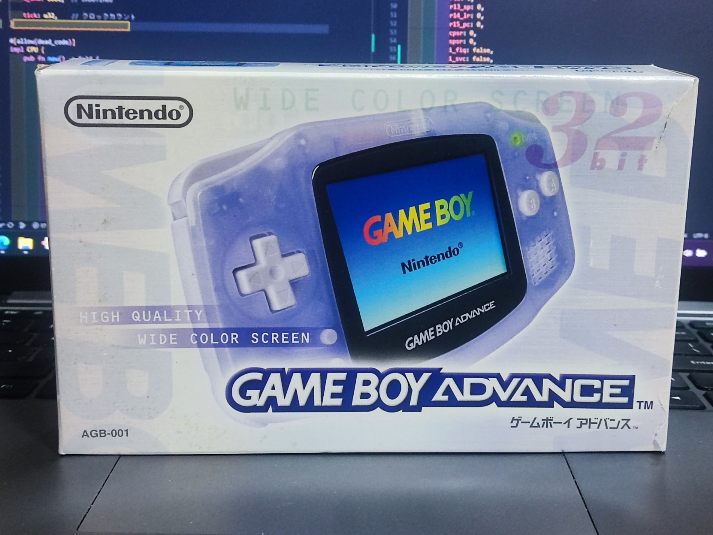
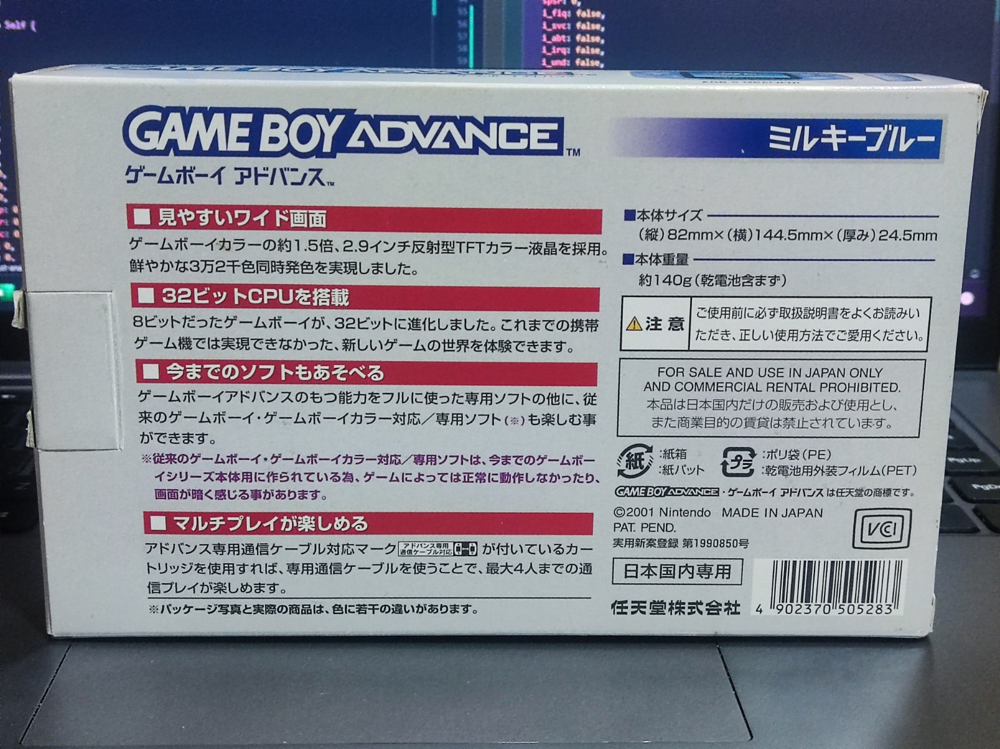

# 📍rsgba©
`rsgba©` is a GBA Emulator Written in Rust(Made in Japan🎌🍣)

The GBA is still the best Nintendo console!  
 I love GBA. You love too?  

# 📍Develop
This GBA was bought for me when I was 5 years old.  
I played with this GBA many times and took it apart many times to understand the GBA.  
It really is a beautiful and well made console!  

# 📍Future / PJ Status📊

Developing (Since July 2023)
  - 

| Task | Status |
|-----|-------|
|ARM7TDMI Thumb Opcodes (16bit)| ✅ (complete)|
|ARM7TDMI ARM Opcodes (32bit)| 🔜 (future)|
|Bus (8/16/32bit)| ✅ (complete)|
|DMA| 🔜 (future)|
|Timer| 🔜 (future)|
|GPIO (Keypad Input)| 🔜 (future)|
|Interrupt (FIQ/SVC/Abort/IRQ/Undefine)| 🔜 (future)|
|BIOS| 🔜 (future)|
|LCD Video Controller| 🔜 (future)|
|Sound Controller| 🔜 (future)|
|GAME Pak ROM| 🔜 (future)|
|GAME Pak Flash| 🔜 (future)|
|GAME Pak SRAM| 🔜 (future)|
|GAME Pak FRAM| 🔜 (future)|
|GAME Pak EEPROM| 🔜 (future)|
|GAME Pak RTC| 🔜 (future)|
|GAME Pak Sensor| ❌ (Not Support)|
|Communication Port (SPI)| ➖ (TBD)|
|SM83(GB/GBC CPU)| ❌ (Not Support)|
|GBA H/W Bug`s| ➖ (TBD)|

# 📍Reference🎓📘📖
## 📍ARM7TDMI
https://developer.arm.com/documentation/ddi0234/b/introduction/about-the-arm7tdmi-s-processor
### 📍Technical Reference Manual
https://developer.arm.com/documentation/#cf[navigationhierarchiesproducts]=IP%20Products,Processors,Classic%20Processors,Arm7,ARM7TDMI
## 📍GBA
https://gbadev.org/  
https://gbadev.net/resources.html  
https://gbadev.net/gbadoc/intro.html  
https://www.problemkaputt.de/gbatek.htm  
https://www.copetti.org/writings/consoles/game-boy-advance/  